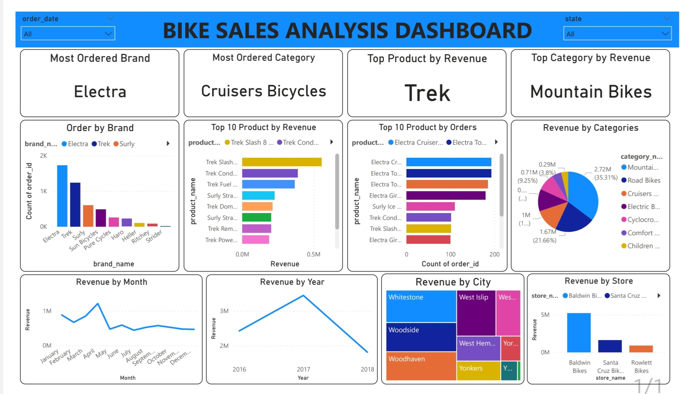

# Data Analytics Portfolio

Welcome to my data analytics portfolio. This repository contains projects where I use data analysis tools to clean, analyze, visualize, and communicate insights from real-world datasets.

## Projects

### 📊 Excel — Customer Behavior & Product Performance Analysis

An Excel project analyzing customer behavior, product performance, sales, and interactions.

**Tools used:**
- Microsoft Excel
- Power Query
- Power Pivot
- DAX
- PivotTables
- PivotCharts
- Slicers
- Timeline

**Key areas analyzed:**
- Product sales and revenue
- Customer interactions
- Product ratings
- Revenue trends
- Customer demographics
- Device usage
- Loyalty tiers

### Dashboard

### Customer Behavior & Product Performance Dashboard

---

### 📈 Power BI — Bike Sales Analysis

An interactive Power BI dashboard analyzing bike sales performance across products, categories, brands, stores, cities, and time periods.

**Tools used:**
- Power BI
- Power Query
- DAX
- Data Modeling
- Relationships

**Key areas analyzed:**
- Revenue and sales performance
- Product performance
- Product categories
- Brands
- Stores and cities
- Monthly and yearly sales trends
- Top products

#### Dashboard

---

## Skills

- Excel
- Power Query
- Power Pivot
- Power BI
- DAX
- Data Cleaning
- Data Modeling
- Data Visualization
- SQL
- Python

## More Projects Coming Soon

SQL and Python projects will be added as I continue building my data analytics portfolio.
